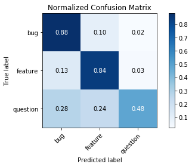

# Evaluate Model

Compute a confusion matrix


```python
from tensorflow.keras.models import load_model
from utils import plot_confusion_matrix


#load the test data and labels
test_body_vecs = np.load('test_body_vecs.npy')
test_title_vecs = np.load('test_title_vecs.npy')
test_labels = np.load('test_labels.npy')

#load the best model
best_model = load_model('Issue_Label_v1_best_model.hdf5')

#get predictions
y_pred = np.argmax(best_model.predict(x=[test_body_vecs, test_title_vecs],
                                      batch_size=15000),
                   axis=1)

# get labels
y_test = test_labels[:, 0]
```

    /usr/local/lib/python3.6/dist-packages/tensorflow/python/ops/gradients_impl.py:112: UserWarning: Converting sparse IndexedSlices to a dense Tensor of unknown shape. This may consume a large amount of memory.
      "Converting sparse IndexedSlices to a dense Tensor of unknown shape. "


```python
plot_confusion_matrix(y_test, 
                      y_pred, 
                      classes=np.array(['bug', 'feature', 'question']), 
                      normalize=True, 
                      title='Normalized Confusion Matrix')
```

    Normalized confusion matrix
    [[0.88173203 0.09765211 0.02061586]
     [0.1303451  0.83997974 0.02967516]
     [0.27873486 0.23896011 0.48230502]]


    <matplotlib.axes._subplots.AxesSubplot at 0x7f487d90af60>





# Make Predictions


```python
from utils import IssueLabeler
from tensorflow.keras.models import load_model
import dill as dpickle
```


```python
#load the best model
best_model = load_model('Issue_Label_v1_best_model.hdf5')

#load the pre-processors
with open('title_pp.dpkl', 'rb') as f:
    title_pp = dpickle.load(f)

with open('body_pp.dpkl', 'rb') as f:
    body_pp = dpickle.load(f)
    
# instantiate the IssueLabeler object
issue_labeler = IssueLabeler(body_text_preprocessor=body_pp,
                             title_text_preprocessor=title_pp,
                             model=best_model)    
```

    Using TensorFlow backend.


```python
issue_labeler.get_probabilities(body='Can someone please help me?', 
                                title='random stuff')
```


    {'bug': 0.12618249654769897,
     'feature': 0.1929263472557068,
     'question': 0.6808911561965942}


```python
issue_labeler.get_probabilities(body='It would be great to add a new button', 
                                title='requesting a button')
```


    {'bug': 0.019261939451098442,
     'feature': 0.9305700659751892,
     'question': 0.05016808584332466}


```python
issue_labeler.get_probabilities(body='It does` not work, I get bad errors', 
                                title='nothing works')
```


    {'bug': 0.9065071940422058,
     'feature': 0.03202613815665245,
     'question': 0.06146678701043129}


